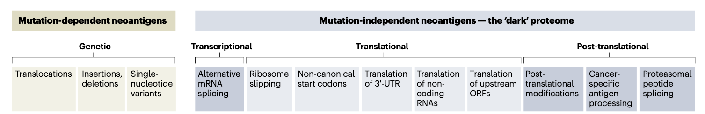
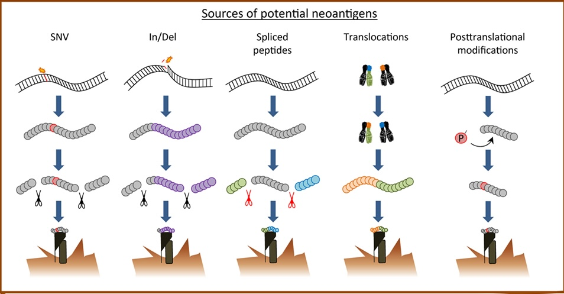

## SAC Proposal (Project 1)

### Introduction
1. Cancer is driven by genetic abnormalities, specifically nonsynonymous DNA mutations, such as single nucleotide variants (*SNVs*) or small insertions and deletions (*indels*), and gene fusions due to chromosomal rearrangements or translocations (Vogelstein et al., 2013)

2. These genetic aberrations can translate into tumor-specific neoantigens – a class of altered, foreign protein products that are only expressed in one particular tumor cell and absent in normal, healthy cells

3. The resulting neoantigens can be highly immunogenic and may induce an antitumor adaptive immune response as the immune system will see them as 'nonself' (Gubin et al., 2015)

4. Neoantigens can be generalized into mutation-dependent and mutation-independent neoantigens (**Figure 1**)that could be produced through various molecular mechanisms at different levels of regulation (genetic, transcriptional, translational, post-translational).

5. Cancer neoantigens have canonically been studied in the context of SNVs in the protein-coding exome, but noncanonical neoantigens from genetic alterations that produce fusion genes and transcriptional aberrations that dysregulate normal alternative splicing events (ASE) remain largely unexplored (Capietto et al., 2022)

6. These alternative sources of neoantigens can theoretically produce tumor-specific neopeptides (**Figure 2**) that can bind to MHC molecules to mount an adaptive immune response in patients, especially in tumor types with low tumor mutational burden, a proxy metric that tends to be biased towards SNV-derived neoantigens.

### Significance 

* Personalized neoantigen-based vaccine development targets a set of both unique, *private* neoantigens alongside recurrent, *public* neoantigens. Such vaccine targets are tailored to individual patients and thus impose prohibitive logistical and financial contraints to widespread clinical accessibility (Pearlman et al., 2021)

* Focusing research efforts on discovering shared (public) tumor-specific neoantigens that can be targeted via an *of-the-shelf* immunotherapy may be more realistic and may speed up clinical translation

* Compiling a neoantigen database that covers neoantigens from sources beyond single base mutations and indels of coding regions of the genome would expand the space of neoantigen repertoire to inform future neoantigen-based therapeutic development

* Contextualizing neoantigen discovery with a specific Asian population would also address genomic data inequity that is currently inherent in genomic precision medicine field that is predominantly Western or European-centric (Tawfik et al., 2023)

* This might lead to a more direct therapeutic impact for local Asian community in Malaysia

### Main Objectives

A) Identification of shared, public neoantigen candidates found amAsian populations owith predicted high immunogenicity for translation into clinical therapy

B) Harnessing mutation-independent neoantigen sources to expand search of therapeutically relevant neoantigens for vaccine targets

### Proposed Methodology

* We have designed a neoantigen prediction framework (Fig 2) from which a Nextflow pipeline could be designed to identify potential neoantigens derived from alternative tumor-specific sources of genomic and transcriptomic alterations as described previously. 

The Nextflow pipeline is highly modular and would allow different prediction modules to be "plugged and played" as desired, based on a specific neoantigen-deriving aberrant source. 

#### ***Gene Fusions***

lorem ipsum

#### ***Aberrant ASE***

lorem ipsum

#### ***
