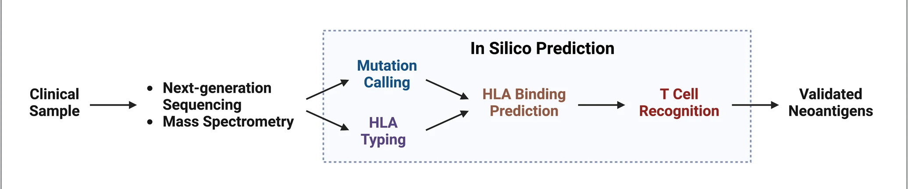
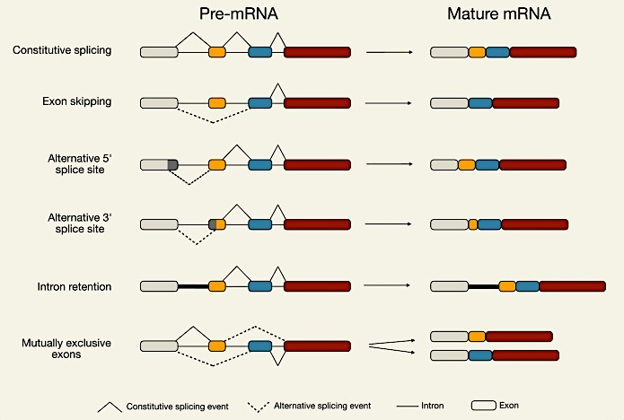

## SAC Proposal (Project 1)

### Introduction
1. Cancer is driven by genetic abnormalities exemplified by single nucleotide variants (*SNVs*) or small insertions and deletions (*indels*)

2. They can translate to tumor-specific neoantigens – a class of altered, foreign protein products that are only expressed in one particular tumor cell and absent in normal, healthy cells

3. The resulting neoantigens can be immunogenic and may induce an antitumor adaptive immune response as the immune system will see them as 'nonself' (Gubin et al., 2015)

4. Neoantigens can be generalized into mutation-dependent and mutation-independent neoantigens (Fig. 1), that originate from processes at different levels of regulation

<em>Fig. 1: Categories of neoantigens (adapted from Katsikis et al., 2023)</em>

5. SNV-derived neoantigens have been most of the research focus, but unconventional neoantigens from genetic alterations that produce fusion genes and transcriptional aberrations that dysregulate normal alternative splicing events (ASE) remain largely unexplored (Capietto et al., 2022)

6. These alternative sources of neoantigens can also produce tumor-specific neopeptides (**Fig. 2**), especially in tumor types with low tumor mutational burden, a proxy metric that tends to be biased towards SNV-derived neoantigens

<em>Fig. 2: Theoretical sources of neoantigens (adapted from Bräunlein & Krackhardt, 2017)</em>

### Significance 

* Personalized neoantigen-based vaccine development targets a set of both unique, *private* neoantigens alongside recurrent, *public* neoantigens. Such vaccine targets are tailored to individual patients and thus impose prohibitive logistical and financial contraints to widespread clinical accessibility (Pearlman et al., 2021)

* Focusing research efforts on discovering shared (public) tumor-specific neoantigens that can be targeted via an *of-the-shelf* immunotherapy may be more realistic and may speed up clinical translation

* Compiling a neoantigen database that covers neoantigens from sources beyond single base mutations and indels of coding regions of the genome would expand the space of neoantigen repertoire to inform future neoantigen-based therapeutic development

* Contextualizing neoantigen discovery with a specific Asian population would also address genomic data inequity that is currently inherent in genomic precision medicine field that is predominantly Western or European-centric (Tawfik et al., 2023), hopefully leading to a more direct therapeutic impact for local Asian community in Malaysia

**Project Objective** 
> **Identification of highly immunogenic and shared, public neoantigen candidates in Asian populations by harnessing neoantigen-producing sources beyond SNVs to expand neoantigen prediction space for a faster and more comprehensive clinical translation**

### Proposed Methodology

We have designed a Nextflow pipeline following a generalized neoantigen prediction framework (**Figure 3**) to identify potential neoantigens derived from alternative tumor-specific sources of genomic and transcriptomic alterations as described previously. 

<em>Figure 3: General in silico framework for cancer neoantigen identification (adapted from Xie et al., 2023)</em>

#### A. Aberrant Transcriptome Detection

The Nextflow pipeline is highly modular and would allow different prediction modules to be "plugged and played" as desired, based on a specific neoantigen-deriving aberrant source. Two aberrant neoantigen-producing mechanisms have been chosen as our primary focus in establishing an Asian cancer neoantigen database.

	1. ***Gene fusion neoantigens (FNs)***: They represent the aberrant output of gene fusions caused by chromosomal genetic rearrangements via translocations, deletions, or inversions

	2. ***Alternative splicing-derived neoantigens (ASNs)***: We will focus on *aberrant* splicing events that produce neopeptides that are absent in normal cells

##### ***Gene Fusions***

* We optimized a gene fusion transcript calling using two published bioinformatics tools – Arriba and FusionCatcher on RNA-seq data from our local breast cancer cohort, MyBRCA, and combined the fusion transcript calling output into a preliminary fusion transcript candidate list

* These would be filtered for tumor-specific and recurrent, public fusion transcripts using similar fusion transcript calling output obtained from sample-matched RNA-seq data of tumor-adjacent normal cells

***insert graphical details of all the tools used in the pipeline?***

##### ***Alternative Splicing Events***

* In general, there are five different processes involving alternative RNA splicing; exon skipping, alternative 5' splice site, alternative 3' splice site, exon mutual exclusion, and intron retention (**Figure 4**)

<em>Figure 4: Types of alternative RNA splicing (adapted from Verta & Jacobs, 2022)</em>

* Dysregulation in alternative RNA splicing is commonly found in tumor transcriptomes (Dvinge & Bradley, 2015), and tumor-specific intron retention splicing events contribute a significant proportion of neoantigen load in cancer (Smart et al., 2018). Novel exon-exon junctions (EEJs) could also potentially generate immunogenic peptides, and recurrent EEJ-derived neoepitopes that are tumor-exclusive have also been previously reported (Kahles et al., 2018).  

* Two candidate tools that can identify specific AS events, especially intron retention, are `spladder`, implemented in Python, and `FRASER`, packaged on Bioconductor for use in R environments.

#### B. HLA Binding Prediction

#### C. T-Cell Recognition Prediction

